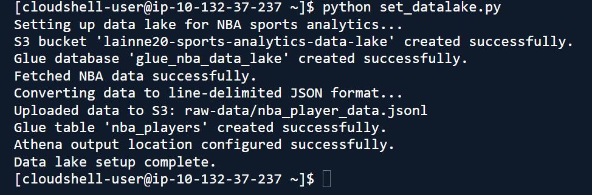
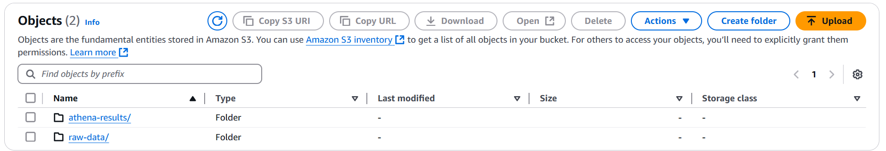

# NBA Data Lake
This repository contains the `nba-data-lake.py` script, which automates the creation of a data lake for NBA analytics using AWS services. The script integrates Amazon S3, AWS Glue, and Amazon Athena to set up the infrastructure needed to store and query NBA-related data.

---

## Overview
The `nba-data-lake.py` script performs the following actions:

1. **Amazon S3**: Creates a bucket to store raw and processed data.
2. **Sample Data**: Uploads NBA data in JSON format to the S3 bucket.
3. **AWS Glue**: Creates a database and an external table for querying the data.
4. **Amazon Athena**: Configures query access for data stored in S3.

---

## Prerequisites
Before running the script, ensure the following:

### SportsData.io Setup
1. Create a free account on [SportsData.io](https://sportsdata.io).
2. Navigate to **Developers > API Resources** and select **NBA**.
3. Sign up for the **SportsDataIO API Free Trial**.
4. Retrieve your API key from the "Query String Parameters" section under the **Standings** endpoint.

### IAM Role/Permissions
The user or role running the script must have the following permissions:
- **S3**: `s3:CreateBucket`, `s3:PutObject`, `s3:DeleteBucket`, `s3:ListBucket`
- **Glue**: `glue:CreateDatabase`, `glue:CreateTable`, `glue:DeleteDatabase`, `glue:DeleteTable`
- **Athena**: `athena:StartQueryExecution`, `athena:GetQueryResults`

---

## Step-by-Step Instructions

### Step 1: Open AWS CloudShell
1. Sign in to your AWS account at [aws.amazon.com](https://aws.amazon.com).
2. Click the **CloudShell** icon (a terminal symbol with `>_`) next to the search bar.

### Step 2: Create the `nba-data-lake.py` File
1. In the CloudShell CLI, type:
   ```bash
   nano nba-data-lake.py
   ```
2. Copy the script from `scr/` and paste it into the editor.
3. Replace the placeholder `api_key` under the `# Sportsdata.io configurations` section with your actual API key.
4. Save the file:
   - Press `Ctrl + X`, then `Y`, and hit `Enter`.

### Step 3: Create the `.env` File
1. In CloudShell, type:
   ```bash
   nano .env
   ```
2. Paste the following lines into the file, replacing `your_sportsdata_api_key` with your actual API key:
   ```bash
   SPORTS_DATA_API_KEY=your_sportsdata_api_key
   NBA_ENDPOINT=https://api.sportsdata.io/v3/nba/scores/json/Players
   ```
3. Save and exit the file using `Ctrl + X`, `Y`, and `Enter`.

### Step 4: Run the Script
1. Execute the script to set up the data lake:
   ```bash
   python3 setup_nba_data_lake.py
   ```
2. Confirm successful creation of:
   - S3 bucket
   - Sample data upload
   - Glue database and tables

 

### Step 5: Verify the Resources

#### In Amazon S3
1. Open the **S3** service in the AWS Management Console.
2. Locate the bucket named `lainne-sports-analytics-data-lake`.
3. Inspect the `raw-data` folder for the `nba_player_data.json` file.



#### In Amazon Athena
1. Open the **Athena** service in the AWS Management Console.
2. Run the following sample query:
   ```sql
   SELECT FirstName, LastName, Position, Team
   FROM nba_players
   WHERE Position = 'PG';
   ```
   


---

## What You’ll Learn
By completing this project, you’ll gain hands-on experience in:

1. **IAM Policies**: Securing AWS services with least-privilege permissions.
2. **Automation**: Creating and managing AWS resources using Python scripts.
3. **API Integration**: Integrating external APIs into cloud workflows.

---

## Future Enhancements
To expand this project, consider:
1. Automating data ingestion with **AWS Lambda**.
2. Implementing data transformation with **AWS Glue ETL**.


---

This README provides a comprehensive guide for setting up and exploring the NBA Data Lake. Feel free to adapt and enhance the project to meet your specific needs!

